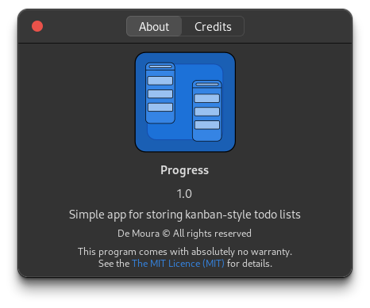
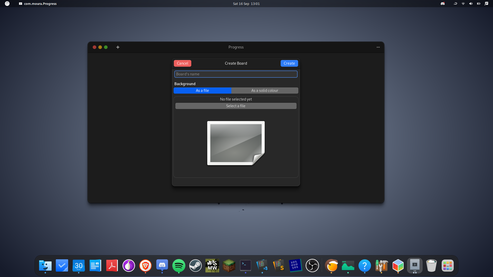

# Progress Tracker

Project is still in development.

## How to build and run the project for now?

The program is being developed only for Linux. Cross-platform will come after
the Linux version is made.

To build on Linux:

1. Install the required dependencies. For now the only dependency being used
here is the gui toolkit gtkmm and the test framework catch2 (optional if you
don't want to create tests binaries.)

    `sudo apt install libgtkmm-4.0-dev libtinyxml2-dev catch2`

2. You also have to have cmake installed.

    `sudo apt install cmake`

3. Configure and build the project using cmake.

    ```sh
    mkdir build/
    cd build/
    # set DTESTS_ENABLED=True if you want to run the tests
    # (ps. they have all passed ;))
    cmake ../progress-tracker/ -DTESTS_ENABLED=False
    ```

4. Because the app now use embedded resources, before building the program it's
important to compile those resources so the app can use them. After issuing this
command, you should be able to see a file called "resources.cpp" within the "ui"
directory.

    ```sh
    cd progress-tracker/ui
    glib-compile-resources --target=resources.cpp --generate-source resources.xml
    ```

5. After that, you can build and run the project.

    ```sh
    cmake --build build-dir
    build-dir/progress-tracker
    ```

## Project current state

At this point, you should get a console message displaying the app's version and
an empty window like this.

<figure>
    <caption>Main View of the appplication</caption>
    
</figure>

<br>

<figure>
    <caption>About Dialog (icon won't be present)</caption>
    
</figure>

<br>

<figure>
    <caption><b>Improved CreateBoardDialog UI</b></caption>
    
</figure>
