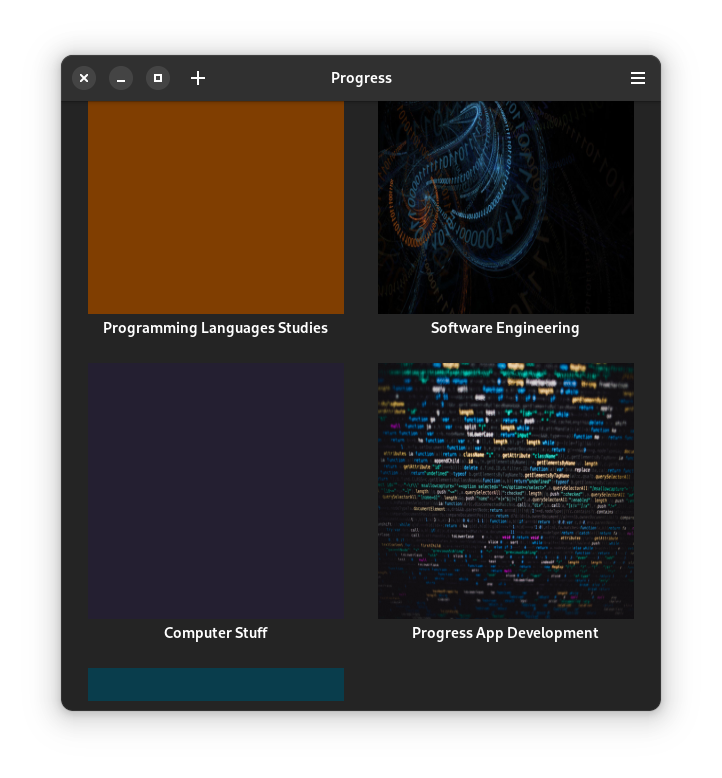
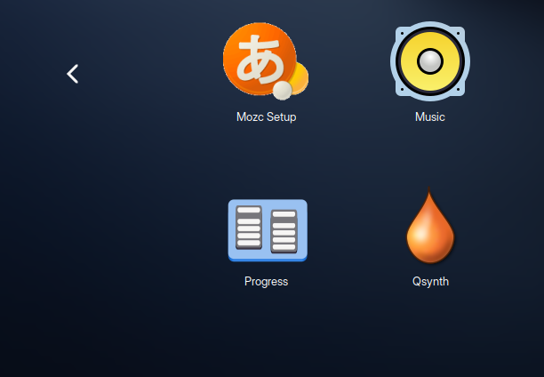

# Progress Tracker



Progress is a TODO app that uses the kanban-style to organise tasks. The uses
varies from keeping track of a project's progress to organising personal tasks. It allows the user to edit the board using an idiomatic drag-and-drop system, and also
customise boards according to the user preference.

## Build

### Dependencies

* cmake
* libgtkmm-4.0-dev
* libtinyxml2-dev
* gettext
* catch2 (for testing)

### Instructions

1. Install the dependencies needed to build the project

```sh
# catch2 is totally optional. Install it only if you're going to run tests
sudo apt install libgtkmm-4.0-dev libtinyxml2-dev gettext catch2
```

2. Clone the project's repo

```sh
git clone https://github.com/smolBlackCat/progress-tracker.git
```

3. Compile the project

```sh
mkdir build/
cd build/
cmake ../ .
make
```

4. Install the project

```sh
sudo make install
```

## Running the Project
After installing, simply issue the command `progress-tracker`, or you can also
start it from the applications menu of your desktop environment.


