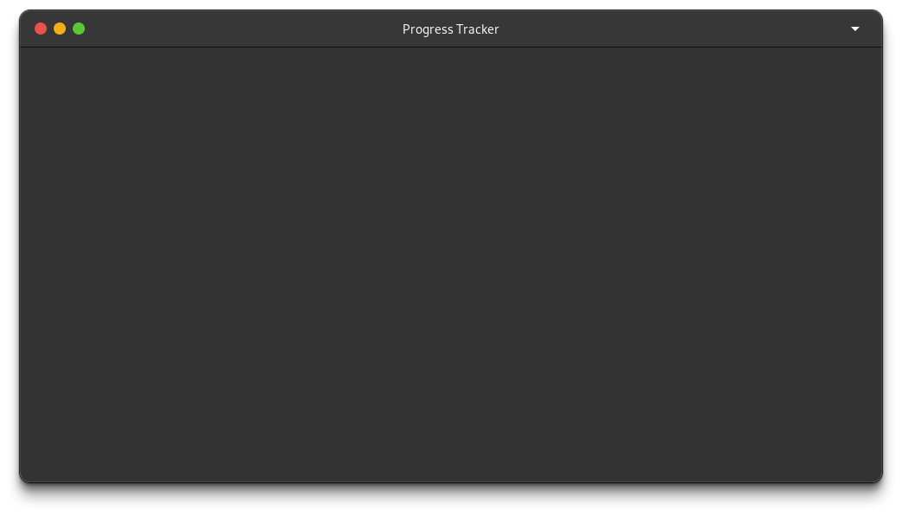

# Progress Tracker

Project is still in development.

## How to build and run the project for now?

The program is being developed only for Linux. Cross-platform will come after
the Linux version is made.

To build on Linux:

1. Install the required dependencies. For now the only dependency being used here
is the gui toolkit gtkmm. This can be done by issuing this command (Debian/Ubuntu systems).

    `sudo apt install libgtkmm-4.0-dev`

2. You also have to have cmake installed.

    `sudo apt install cmake`

3. Create a build directory, navigate into it and issue the command (assuming
that you're in the project's directory).

    ```sh
    mkdir build
    cd build
    cmake ../progress-tracker
    cmake --build .
    ```

4. After all that you should find a binary called progress-tracker. All you have
to do now is to just execute it.

    `./progress-tracker`

At this point, you should get a console message displaying the app's version and
an empty window like this.

<figure>
    
    <caption>Cool Window just for you :)</caption>
</figure>
