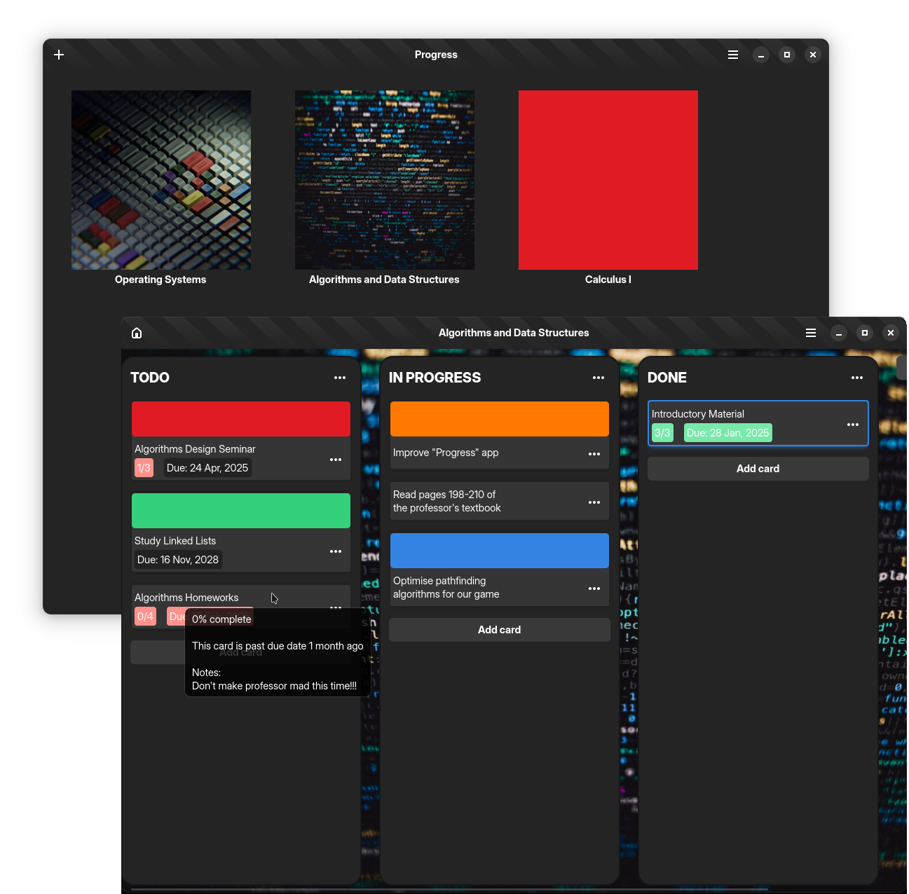

# Progress

Simple kanban-style task organiser

###


<div align="center">
    
</div>

Progress is a simple task management app focused on simplicity yet enough for
most workflows. It can be used on various contexts, from software development
to daily tasks. It is written in C++ using GTK 4(gtkmm) and libadwaita.

## Installation

### Flatpak

Progress is available to download at [Flathub](https://flathub.org/apps/io.github.smolblackcat.Progress).

<a href="https://flathub.org/en-GB/apps/io.github.smolblackcat.Progress">

</a>

### Debian

A debian build is also available. The debian package can be obtained in the [releases](https://github.com/smolBlackCat/progress-tracker/releases) page.

```sh
sudo apt install ./progress-tracker-1.4.deb
```

### Windows

Windows installers are also available in the
[releases](https://github.com/smolBlackCat/progress-tracker/releases) section.
The installers were tested against the following environments.

* Windows 8
* Windows 10
* Windows 11

### Building from Source

For contributing to Progress source code, building from source might be the better option.

#### Dependencies

* cmake
* python3 (required only if building on Windows)
* libgtkmm-4.0-dev
* libadwaita-1-dev
* libtinyxml2-dev
* gettext
* catch2 (optional)

#### Building on Linux

1. Install the dependencies

    ```sh
    # Use your package manager
    sudo apt install cmake libgtkmm-4.0-dev libadwaita-1-dev libtinyxml2-dev gettext catch2
    ```

2. Clone the project's repository

    ```sh
    git clone https://github.com/smolBlackCat/progress-tracker.git
    ```

3. Configure and compile project.

    ```sh
    cd progress-tracker/
    cmake -S . -B build/ -DCMAKE_BUILD_TYPE=Release
    cmake --build build/
    ```

4. Install the Project

    ```sh
    cmake --install build/
    ```

#### Building on Windows

There are multiple approaches to building projects on Windows. The approach used
by this project is setting up a [MSYS2 environment](https://www.msys2.org/) and
downloading the MSYS dependencies similar to the one listed before. Currently,
the project build settings support only two environments: UCRT64 and MINGW32.

1. Install the dependencies

    ```sh
    # Replace env with either 'ucrt64' or 'mingw32'
    pacman -Syu mingw-w64-env-cmake mingw-w64-env-python mingw-w64-env-gtkmm4 \
        mingw-w64-env-libadwaita mingw-w64-env-tinyxml2 \
        mingw-w64-env-gettext mingw-w64-env-catch git
    ```

2. Clone the project's repository

    ```sh
    git clone https://github.com/smolBlackCat/progress-tracker.git
    ```

3. Configure and compile project

    ```sh
    cd progress-tracker/
    cmake -S . -B build/ -DCMAKE_BUILD_TYPE=Release -DWINDOWS=True
    cmake --build build/
    ```
4. Build installer using
[Inno Setup Script Compiler](https://jrsoftware.org/isinfo.php) (optional).
